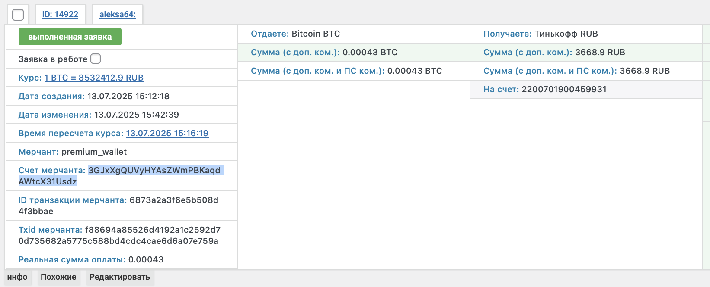
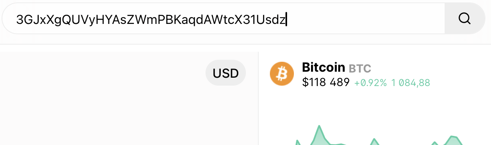
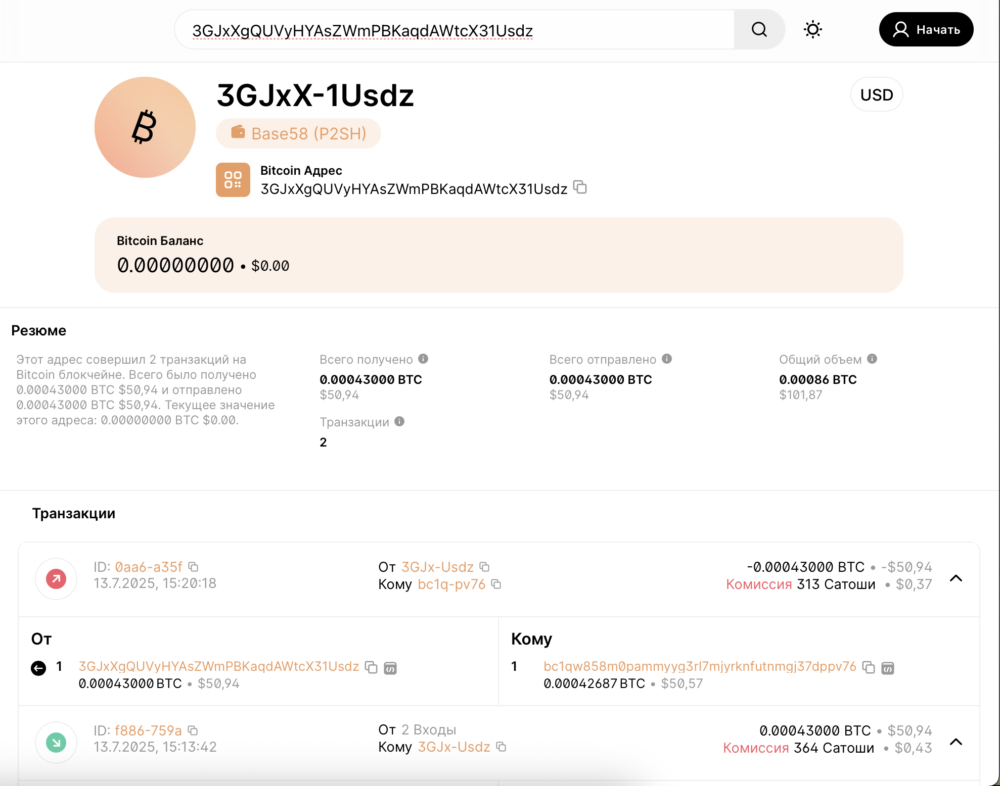
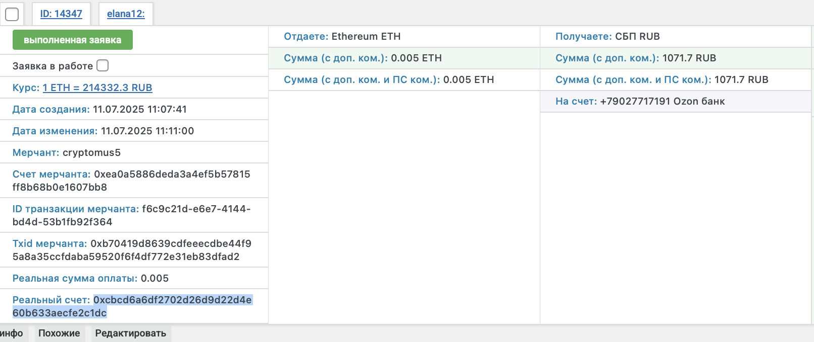
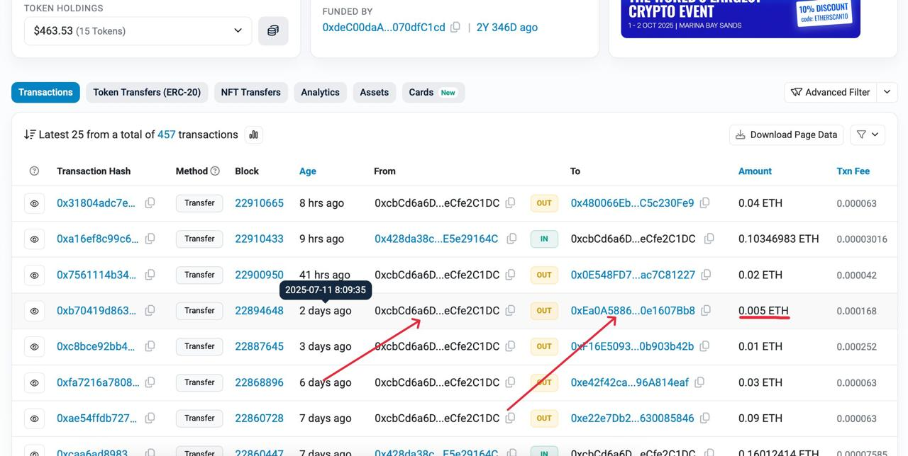
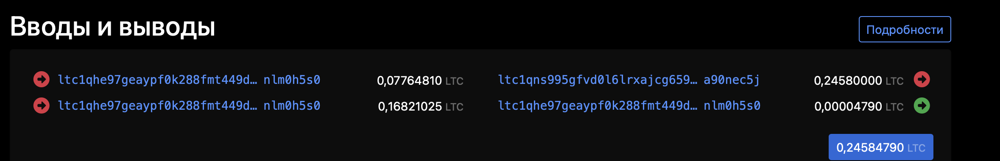
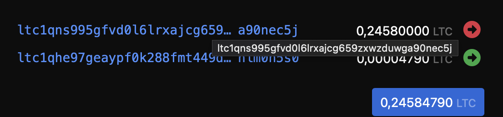
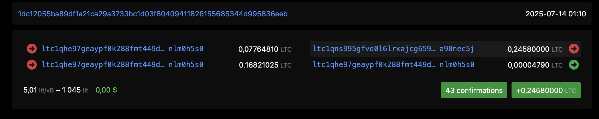
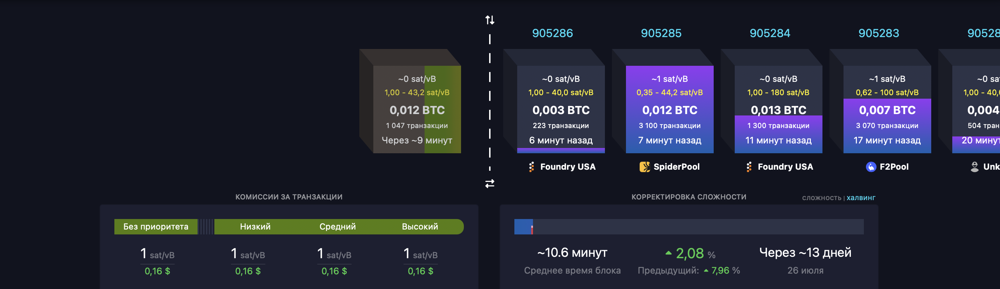

### 1\. **Материалы и темы для изучения (для саппортов и операторов)**

#### 1\.1 **Введение в криптовалюту**

-  **Что такое криптовалюта (Bitcoin, Ethereum, USDT и др.)**

   [https://youtube.com/watch?v=QPOdFedaujY](https://www.youtube.com/watch?v=QPOdFedaujY) (Обязательно к изучению)

-  **Чем отличается крипта от фиатных денег (рубль, доллар)**

#### 1\.2 Что такое **фиатные деньги**?.

Фиат (от лат. «доверие») -- это обычные государственные деньги: рубли, доллары, евро и т.п.\
Они **выпускаются центральными банками** и **не обеспечены физическим товаром** (как золото в прошлом) -- их ценность основана на **доверии к государству и экономике**.

Примеры:

-  Российский рубль (RUB)

-  Доллар США (USD)

-  Евро (EUR)

---

#### **1\.3 ₿ Что такое криптовалюта?**

Криптовалюта -- это **цифровая валюта**, основанная на **блокчейн-технологии**, не контролируется государствами и банками.\
Она создаётся с помощью **алгоритмов (например, майнинг)** и может передаваться **напрямую между людьми**, без посредников.

Примеры:

-  Bitcoin (BTC)

-  Ethereum (ETH)

-  Tether (USDT)

-  Litecoin (LTC)

---

#### 1\.4 Таблица отличий

| Критерий            | Фиатные деньги                      | Криптовалюта                                                                                 |
|---------------------|-------------------------------------|----------------------------------------------------------------------------------------------|
| 📜 Эмитент          | Государство, Центробанк             | Протокол, майнеры или смарт-контракт                                                         |
| 🔧 Контроль         | Полный контроль государства         | Децентрализованная (или частично централизованная)                                           |
| 💰 Обеспечение      | Ничем (основаны на доверии)         | Код, математика, иногда stablecoin привязаны к USD (Например в случае с Tether USDT)         |
| 🌐 Передача средств | Через банк, платёжные системы       | Прямо между кошельками (peer-to-peer)                                                        |
| 🚫 Отзыв транзакции | Можно (в случае ошибки, через банк) | Нельзя отменить (без разрешения получателя)                                                  |
| 📉 Инфляция         | Возможна -- деньги печатаются       | Обычно ограничена (например, у BTC максимум -- 21 млн)                                       |
| 🔐 Приватность      | Частично (банки видят операции)     | Относительная анонимность (в зависимости от монеты, транзакции отслеживаются через блокчейн) |
| 🌍 Глобальность     | Привязаны к стране                  | Глобальные, не зависят от границ                                                             |
| 💻 Форма хранения   | Наличные, банковские счета          | Цифровые кошельки, seed-фразы                                                                |

---

#### 1\.5 Пример: сравнение на практике

| Ситуация                            | Фиат                                | Криптовалюта                                 |
|-------------------------------------|-------------------------------------|----------------------------------------------|
| Перевод денег другу в другую страну | Через банк, с комиссией и задержкой | Через TRON / Bitcoin с комиссией за минуту   |
| Банк закрыл счёт                    | Деньги заблокированы                | Крипта всё равно у тебя, если есть сид-фраза |
| Транзакция не дошла                 | Можно подать запрос в банк          | Проверить в блокчейне, но отменить нельзя    |

---

⚠️ Но:

| Фиат                              | Крипта                                                                                                       |
|-----------------------------------|--------------------------------------------------------------------------------------------------------------|
| Более стабильна (курсы, инфляция) | Высокая волатильность (курс может меняться на 10%+ в день, например у Биткоина. Стейблкоины привязаны к USD) |
| Регулируется, защищена законом    | Практически не регулируется, нет защиты при потере доступа                                                   |

---

## 2 Основные криптовалюты и сети

### 2\.1 Bitcoin (BTC)

-  **Что это:** первая криптовалюта, цифровое «золото», ограниченное количество монет -- 21 млн, используется Proof‑of‑Work, медленные транзакции (\~10 мин) и высокие комиссии

-  **Видео для новичков:**

   -  *Bitcoin Explained Simply* -- наглядно объясняет, что такое Bitcoin, как он работает и почему он важен

      [**Обязательно к изучению**](https://www.youtube.com/watch?v=QPOdFedaujY)

Также рекомендуем поискать русскоязычные видео-уроки по просьбе, нуждающимся саппортам достаточно 10‑мин обзора.

#### 2\.1.1. Как осуществляется проверка платежа.

По адресу (Плательщика, обменника):

Заходим на сайт <https://www.blockchain.com/explorer>, вставляем адрес в поисковую строку, как это показано на скриншоте:

{width=1642px height=666px}

{width=1228px height=364px}

-  {width=1978px height=1556px}

-  Вся информация о данном кошельке. Внизу указаны все транзакции адреса, в том числе и та, которую мы ищем. (Она самая первая, ведь в Админке в заявке указана сумма платежа от клиента - 0.00043 BTC. Клиент по факту столько и заплатил в этой транзакции.

-  Нажимаете на ХЕШ транзакции (Транзакции, смотрите любую и там написано ID: 0aa6-a35f - нажимаем на оранжевую надпись)

-  {width=1970px height=1220px}

-  Вы нашли эту транзакцию, статус, как можно увидеть «ПОДТВЕРЖДЕННЫЙ», адрес получателя можно спросить у нашего админа. Всё сошлось и транзакция в статусе «Подтвержденная» - значит средства у нас, значит клиенту заявку обработать однозначно можно.

НО ПРОВЕРЬТЕ ВСË НЕСКОЛЬКО РАЗ, ИМЕЙТЕ ВВИДУ ВСЕГДА ПРАВИЛО НЕОДНОКРАТНЫХ ПРОВЕРОК.

---

### 2\.2 Ethereum (ETH)

-  **Что это:** криптовалюта + платформа для децентрализованных приложений и смарт-контрактов, перешла на Proof‑of‑Stake, быстрые транзакции, \~15 сек на блок

**Видео для новичков:**

-  Ищите YouTube видео вроде «Что такое Ethereum и как работает», лучше не дольше 10‑12 минут. (Скинете обязательно мне в ЛС видео, которые вы нашли и изучили)

#### 2\.2.1 Как осуществляется проверка платежа.

Заходим на сайт <https://etherscan.io>, вставляем адрес в поисковую строку, как это показано на скриншоте:

{width=1612px height=680px}

Берём адрес из Админки из самой заявки, **ОБРАТИТЕ ВНИМАНИЕ**, что в данной ситуации - адрес клиента именно, а не мерчанта (В предыдущем случае разбирали именно взяв адрес мерчанта, в этот раз - **клиента**, но всё делается по аналогии)

{width=1516px height=870px}

{width=1280px height=644px}

Слева указан адрес ОТПРАВИТЕЛЯ(в данном случае клиента), справа адрес ПОЛУЧАТЕЛЯ (в данном случае обменника), подчёркнута сумма отправления - сходится с заявкой.

-  Чтобы проверить дату - наводите курсором на «2 days ago» и оно покажет вам дату транзакции.

---

### 2\.3 Litecoin (LTC)

**Что это:** «цифровое серебро», форк Bitcoin от Чарли Ли (2011), блоки создаются каждые \~2.5 минуты (быстрее, чем у BTC), максимальное предложение -- 84 млн монет, использует алгоритм Scrypt для майнингаО

[ОБЯЗАТЕЛЬНО К ИЗУЧЕНИЮ](https://www.youtube.com/watch?v=LdiRWCt4aF4&pp=ygUb0L_QvtGP0YHQvdC10L3QuNC1IGxpdGVjb2lu)

#### 2\.3.1. Как осуществляется проверка транзакции:

Заходим на сайт <https://litecoinspace.org/ru/>, вставляем ХЕШ в поисковую строку, как это показано на скриншоте:

 транзакции – это идентификатор платежа в любой системе."){width=1618px height=722px}

{width=1190px height=508px}

{width=2358px height=380px}

Чтобы увидеть эту информацию, необходимо страницу опустить чуть ниже, там будет информация по транзакциям - ищем ту, что отображена у нас в заявке. Тут она находится справа вверху. Сумму 0.2458 LTC, как и в заявке.

{width=1106px height=258px}

{width=2294px height=458px}

Есть транзакция так же справа сверху, отправка(Так как стрелка в право КРАСНАЯ), сумма 0.2458, надпись внизу «43 confirmations» - означает, что транзакция была подтверждена 43 раза, значит деньги точно находятся у нас, уточняйте у Админа.

### **2\.4  Что такое Tether (USDT)?**

**USDT (Tether)** -- это **стейблкоин**, привязанный к курсу доллара США 1:1. Он выпускается компанией **Tether Limited** и **существует в виде токена в разных блокчейнах**.

<note type="quote">

⚠️ Важно: **USDT ≠ доллар США**. Это криптотокен, цена которого привязана к доллару.

</note>

---

## 3\. В каких сетях существует USDT?

| Сеть                  | Имя токена | Протокол / стандарт | Адреса начинаются с | Комиссия оплачивается в | Сканер                                        | Частота использования (по 10 бальной шкале) |
|-----------------------|------------|---------------------|---------------------|-------------------------|-----------------------------------------------|---------------------------------------------|
| Ethereum              | USDT       | ERC-20              | `0x...`             | ETH                     | [etherscan.io](http://etherscan.io)           | 5/10                                        |
| TRON                  | USDT       | TRC-20              | `T...`              | TRX                     | [tronscan.org](http://tronscan.org)           | 10/10                                       |
| BNB Smart Chain (BSC) | USDT       | BEP-20              | `0x...`             | BNB                     | [bscscan.com](http://bscscan.com)             | 8/10                                        |
| Bitcoin (Omni)        | USDT       | Omni Layer          | `1...`, `3...`      | BTC                     | [omniexplorer.info](http://omniexplorer.info) | 2/10                                        |
| Solana                | USDT       | SPL Token           | `So111...` и др.    | SOL                     | [solscan.io](http://solscan.io)               | 2/10                                        |
| Polygon               | USDT       | ERC-20 (на Polygon) | `0x...`             | MATIC                   | [polygonscan.com](http://polygonscan.com)     | 2/10                                        |
| Avalanche C-Chain     | USDT       | ARC-20              | `0x...`             | AVAX                    | [snowtrace.io](http://snowtrace.io)           | 1/10                                        |

---

### 3\.1 Основные три сети USDT в обменниках:

#### 3\.1.1. **USDT TRC-20 (TRON)**

-  **Относительно большие комиссии:** комиссия \~3 USDT при отправке вручную. В обменнике мы используем отправку Энергии, для этого используется специальный отдельный сервис и комиссиия засчёт аренды энергии выходит около \~1 USDT.

-  **Очень быстрая** (несколько секунд)

-  **Адреса**: `T...`

-  **Проверка транзакций**: [tronscan.org](http://tronscan.org)

**Пример TxID:** `a7e6c07a1fdf633c4f227...`\
**Пример адреса:** `TQQKZ6e59NQf...`

---

#### 3\.1.2. **USDT ERC-20 (Ethereum)**

-  **Сеть дорогая**, если оплачивать вручную, мы оплачиваем через Мерчант HELEKET или руками через Cryptomus, комиссия около \~0.2\$ в ETH

-  **Надёжная, но медленнее**, может быть перегружена

-  **Адреса**: `0x...`

-  **Проверка**: [etherscan.io](http://etherscan.io)

**Пример:**

-  Клиент отправил 100 USDT и платит комиссию в ETH (например, 0.003 ETH)

---

#### 3\.1.3. **USDT BEP-20 (Binance Smart Chain)**

-  **Самая дешёвая комиссия** (в BNB) (Меньше 0.1\$)

-  **Очень быстрая**

-  **Адреса такие же как у ERC-20**: `0x...` -- ❗️нельзя спутать

-  **Проверка**: [bscscan.com](http://bscscan.com)

**Как отличить от ERC-20?**

-  Нужно уточнять у клиента сеть (или смотреть в сканере)

-  В BEP-20 комиссия платится в **BNB**, в ERC-20 -- в **ETH**

---

### 3\.2. Важное для саппортов:

| Ошибка клиента                          | Как выглядит                          | Что делать                                                               |
|-----------------------------------------|---------------------------------------|--------------------------------------------------------------------------|
| Отправил USDT в другую сеть             | Например, TRC-20 на ERC-20            | Проверить сканеры, успокоить, попробовать восстановить (если на кошелёк) |
| Дал адрес `0x...`, но выбрал TRC-20     | Не дойдёт -- деньги могут "зависнуть" | Уточнить и объяснить, что сети несовместимы                              |
| Отправил без комиссии (нет ETH/BNB/TRX) | Транзакция не проходит                | Объяснить, что нужна комиссия в нативной монете                          |

---

### 3\.3. Как объяснить клиенту:

<note type="quote">

**«USDT -- это как "обёртка" доллара, но в разных сетях. Каждый блокчейн -- как свой банк. Если вы отправляете из Сбербанка, то получатель не должен быть в Тинькофф -- иначе деньги потеряются. Точно так же: TRC-20 ≠ ERC-20 ≠ BEP-20, исключительно TRC-20 = TRC-20, ERC-20 = ERC-20»**

</note>

---

## 4\. Что такое блокчейн, но простыми словами (для общего понимания)

### **4\.1. Блокчейн** (от англ. *blockchain* -- "цепочка блоков") -- это **цифровой журнал (база данных), в котором информация записывается в виде последовательной цепочки блоков**, и каждый блок содержит данные о предыдущем.\\

Главное: его **нельзя подделать**, удалить или изменить задним числом без следов.

[**Обязательно к изучению**](https://www.youtube.com/watch?v=ksZ6YhrErOk)

---

#### Простое объяснение

Представь блокчейн как **тетрадь**, где каждая страница -- это блок, и каждая новая страница **пронумерована, подписана, и зависит от предыдущей**. Если кто-то попытается вырвать или подменить страницу -- это будет сразу заметно.

---

### 4\.2. Главные свойства блокчейна

<table header="row">
<colgroup><col width="372"/><col width="372"/></colgroup>
<tr>
<td>

Свойство

</td>
<td>

Объяснение

</td>
</tr>
<tr>
<td>

📚 Цепочка блоков

</td>
<td>

Каждая запись (блок) ссылается на предыдущий -- как замкнутая цепь

</td>
</tr>
<tr>
<td>

✍️ Неизменяемость

</td>
<td>

Изменить данные в старом блоке нельзя без изменения всех последующих

</td>
</tr>
<tr>
<td>

🌍 Децентрализация

</td>
<td>

Блокчейн хранят сразу **тысячи компьютеров по всему миру**

</td>
</tr>
<tr>
<td>

🔎 Прозрачность

</td>
<td>

Любой может проверить данные (например, перевод криптовалюты)

</td>
</tr>
<tr>
<td>

✅ Подтверждение

</td>
<td>

Перед записью данные подтверждаются участниками (майнерами, валидаторами)

</td>
</tr>
</table>

---

### 4\.3 Что хранится в блокчейне?

-  Транзакции (переводы криптовалют)

-  Данные смарт-контрактов

-  В некоторых сетях -- даже NFT, голосования и т.п.

---

### 4\.4. Пример блока:

`{ "номер блока": 12058214, "предыдущий хеш": "0xA45F...", "время": "2024-06-20 18:23", "транзакции": [ {"от": "0x123", "кому": "0x456", "сумма": 1.5 ETH}, {"от": "0x789", "кому": "0xABC", "сумма": 100 USDT} ] }`

---

### 4\.5. Как работает блокчейн:

1. Кто-то делает перевод (например, 1 BTC)

2. Транзакция попадает в "мемпул" -- очередь

3. Майнер или валидатор **подтверждает** и собирает блок

4. Новый блок добавляется к цепочке, и все видят результат

Например на mempool.space (BTC) можно увидеть с правой стороны какие блоки были добыты, сколько минут назад, так же какие транзакции были в этих блоках. С правой стороны можно увидеть когда будет добыт следующий блок (Информация примерная, не точная), а так же можно увидеть какая комиссия в данный момент в блокчейне используется.

{width=2850px height=826px}

---

📖 Аналогия:

Блокчейн -- это **общая бухгалтерская книга**, которую **никто не может стереть или переписать**, а каждый участник может видеть и проверять.

---

<table header="row">
<tr>
</tr>
</table>
