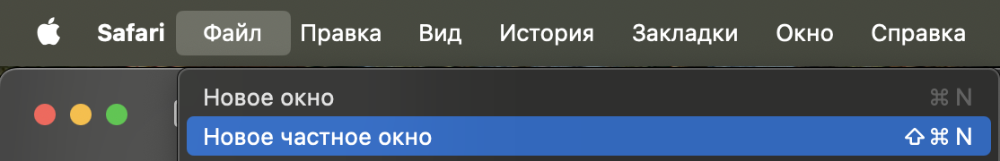
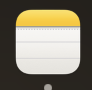
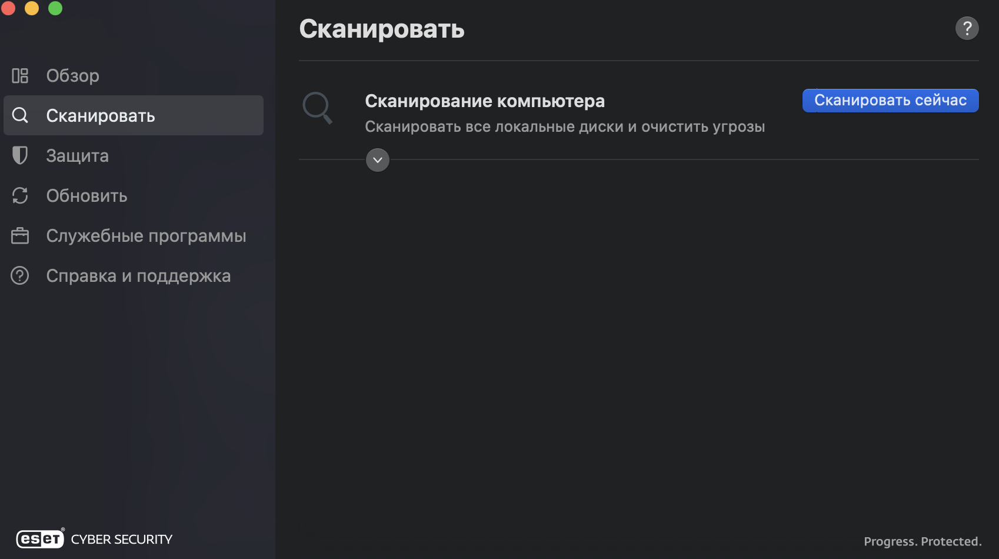

### 1\. Безопасность устройства

#### 1\.1. Браузерная безопасность:

-  В вашем браузере обязательно должны быть отключены авто-авторизации.

-  Браузеры только официальные. Максимум разрешения для саппортов: **SAFARI, Google Chrome** (Скачаный только с официального сайта, обязательно проверить)

-  В браузерах обязательно нужно заходить везде с Частного доступа или Инкогнито.

   Скрин для Safari, как пример включения Частного режима:

   {width=1114px height=180px}

<note>

**ОБЯЗАТЕЛЬНО – НОВАЯ СМЕНА – НОВЫЕ СЕАНСЫ С ЧАСТНЫХ ОКОН**

</note>

#### 1\.2 Безопасность приложений:

-  Приложения только с официальных источников, проверьте вплоть до мельчайших деталей, каждая буква в ссылке, любое подозрение, лучше спросить у Главного администратора, мы подскажем вам, как лучше будет поступить.

-  Для работы на данном этапе в Обменнике не требуется устанавливать никаких приложений, кроме TELEGRAM, даже Google Chrome не обязателен - **он используется** **только для удобства, как второй браузер**.

#### 1\.3 Где делать безопасные записки?

-  Исключительно ЗАМЕТКИ. Приложение с иконкой:

   {width=92px height=90px}

Обязательно прежде установите пароли на каждую используемую заметку.

#### 1\.4 Парольная безопасность:

-  Все пароли в обязательном порядке должны быть формата:

   **N82m!M02A-PmY%Lks-jsu\$Pai (Минимум 12 символов, минимум 3 специальных символа, минимум 3 Заглавных буквы)**

-  **Никогда не хранить пароли в:**

   Telegram

   Записки на компьютере (За исключением запароленных заметок)

### 2\. ESET CYBERSECURITY – антивирус

#### 2\.1 Без антивируса нельзя выходить на смену.

#### 2\.2 Перед каждой сменой в обязательном порядке необходимо просканировать систему на наличие вредоносных файлов и прочего.

{width=1698px height=950px}

### 3\. Аккаунтная безопасность

#### 3\.1. Аккаунты всех мессенджеров, всех ваших аккаунтов (Типо Google, yandex и тд., в общем и целом - любые аккаунты) должны быть зарегистрированы только на существующий физический номер, к которому есть и будет доступ ВСЕГДА.

### 4\. Платёжная безопасность

#### 4\.1. В обязательном порядке проверяйте суммы по заявкам, суммы фактические, всё должно сходиться - всегда! Проверьте 7 раз. Получая данный документ - вы подтверждаете факт ответственности  за проделанные ОШИБОЧНО манипуляции с заявками. (Например: В спешке отправили не по той заявке средства)

#### 4\.2. Обязательно проверяйте адрес получателя при ручной отправке, первые 6 символов и последние 6 символов проверяйте обязательно, этого будет вполне достаточно.

<note>

ЗАПОМНИТЕ!

У нас в обменнике существует регламент, он прописан в правилах, **клиент подождёт выполнения заявки!**

**ВРЕМЯ НА ПРОВЕРКУ ЕСТЬ ВСЕГДА! ПРОВЕРЯЙТЕ НЕСКОЛЬКО РАЗ ВСË, КАЖДУЮ МЕЛОЧЬ, КАЖДУЮ ДЕТАЛЬ.**

</note>