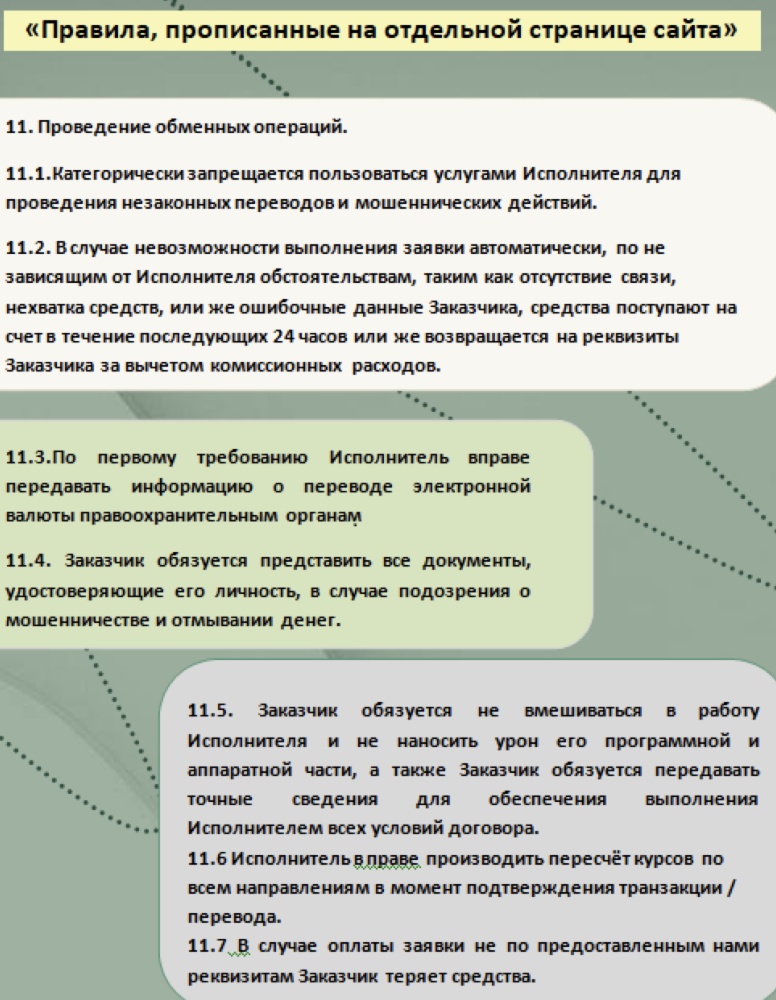
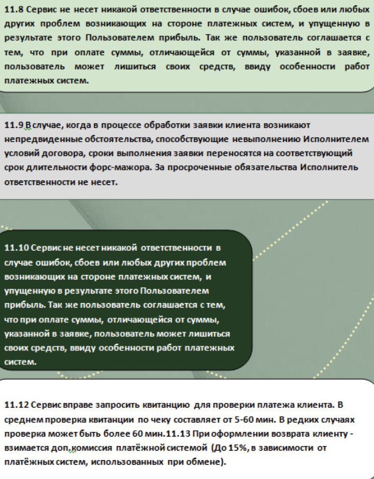
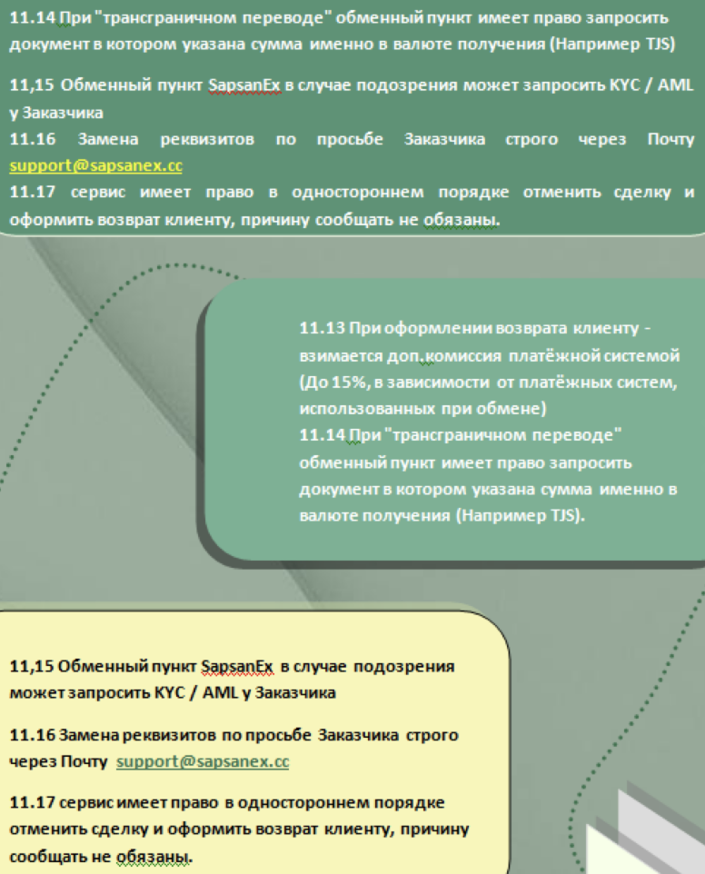
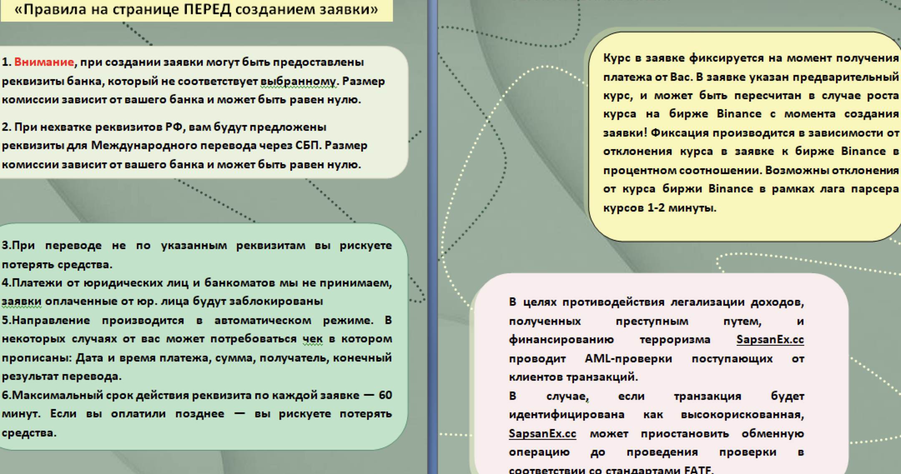
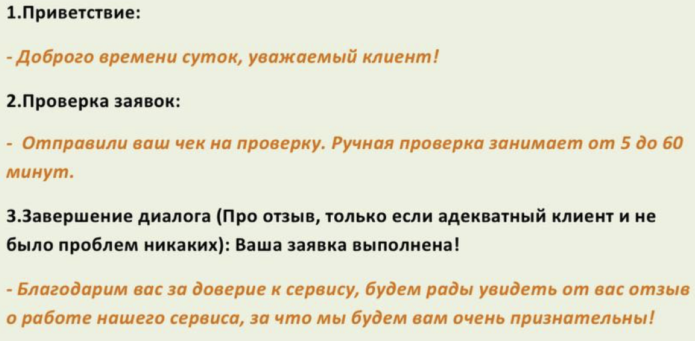

### 1\. Осуществление коммуникации с клиентом:

#### 1\.1. Общение в JIVO, Telegram и тд.:

-  В обязательном порядке приветствие должно происходить с обращением, то есть в нашем случае «Уважаемый клиент». (Частить с этим выражением не стоит, за весь диалог хватает \~2 раза для данного выражения)

-  Никогда не скачивайте непонятные файлы, которые присылают клиенты в чаты. **Вам могут закинуть вредоносное ПО.** (Вы поймёте это, если скачаете и начнётся какая-либо распаковка) **Всё, что вам нужно будет скачивать - изображения, видео, PDF файлы.** (У них не предусмотрено никакой распаковки)

<note>

За орфографию будут вопросы, предупреждения и при неоднократном нарушении - штрафы. Поэтому, будьте добры, проверьте написание и структуру предложения(-ий), проверяться будет каждый день каждый диалог. Пунктуативно вы так же должны обязательно грамотно вести диалог. – Грамотность специалистов - показатель сервиса. У нас должен быть грамотный сервис, без всяких закосов в сторону «Гоп» общения и прочей безграмотности.

</note>

### 2\. Знание правил сайта и проведения обмена

<https://sapsanex.cc/tos/>

<note type="lab">

Вам обязательно необходимо знать правила работы сайта и правила проведения, все регламенты и прочее для обеспечения комфортного и конструктивного диалога с клиентом.

</note>

#### **2\.1 Правила сайта на отдельной странице:**

-  {width=776px height=1000px}

   {width=772px height=988px}

-  {width=776px height=962px}

-  *Пояснение: В данной памятке изображены правила, которые прописаны у нас на сайте на отдельной странице. То есть допустим вы запросили чек и клиент в чате пишет вам "Я не предоставлю чек, проверьте без чека" - мы конечно попробуем проверить без чека (Попросить мерчант можно аккуратно и единоразово), НО вы можете ссылаться на п.11.12 нашего сервиса как он указан в памятке. Все, прописанные выше, правила находятся тут:* [*https://sapsanex.cc/tos/*](https://sapsanex.cc/tos/)

#### 2\.2. **Правила прописанные на странице ПЕРЕД созданием заявки**

{width=2160px height=1138px}

*Пояснение: В данной памятке изображены правила, которые прописаны у нас на сайте ПЕРЕД созданием заявки, то есть выбрали направление после чего перекидывает на эту страницу, где указаны данные правила, то есть клиент ознакамливается с ними и создаёт обмен. (Отличие в том, что тут в Памятке 2 клиент эти правила В ЛЮБОМ СЛУЧАЕ видит. А по Памятке 1 клиент правила видит только если перейдет на отдельную страницу сервиса)*

#### 2\.3 **По скриптам ответов**, ответы в себе должны ОБЯЗАТЕЛЬНО содержать эти выражения при определённых взаимодействиях (1,2,3)

{width=1042px height=512px}

*Завершение диалога - про отзыв упоминаем если клиент адекватный и никаких проблем не происходило с ним.*

#### 2\.4 **Регламент ответов. Вам необходимо отвечать не позднее указаных сроков.**

1. JIVO - 3 минуты.

2. Telegram - 5 минут.

3. Почта - 15 минут.

4. Регламент пуша саппортов по проверке чеков - каждые 15-20 минут.

### 3\. Замена реквизитов:

**11\.16 Замена реквизитов по просьбе Заказчика осуществляется только через почту Обменного пункта, которая указана на Главной странице сайта** [**sapsanex.cc**](http://sapsanex.cc)**. Клиент направляет письмо на указанный почтовый адрес в формате: Прошу заменить реквизиты по заявке №\[номер заявки\], предыдущие реквизиты -- \[реквизит\], новые реквизиты -- \[реквизит\]. Обменный пункт отправит ответное письмо с уточнением согласия на замену реквизитов, Заказчику необходимо ответить "Подтверждаю" или "Согласен" на данное письмо.**

То есть вы клиенту сообщаете об этом пункте из правил и только в таком режиме выполняете замену реквизитов! Никак иначе.

Получили сообщение от клиента с заменой реквизитов - ОТВЕТИЛИ клиенту на его письмо «Подтверждаете ли вы и тд….» И ТОЛЬКО В СЛУЧАЕ, КОГДА КЛИЕНТ ОТВЕТИТ НА ВАШЕ ПИСЬМО «Подтверждаю, согласен и тд» - делаем замену реквизитов внутри админки по самой заявке.

### 4\. Коммуникация с мерчантами и прочими «Коллегами»

#### 4\.1 Приветствие и коммуникация **ИСКЛЮЧИТЕЛЬНО В ДРУЖЕСТВЕННОМ ФОРМАТЕ.**

-  **Приветствие с обращением - «Коллеги». (Например: Добрый день, коллеги! Проверьте, пожалуйста, чек)**

-  Не хамим, не дерзим, не конфликтуем, не ведёмся на провокацию, если таковая вдруг предполагается.

#### 4\.2 Коммуникация внутри команды

-  При возникновении любого подозрения, любого сомнения в любом вашем действии - МАЛЕЙШЕЕ СОМНЕНИЕ, переспросите у админа, у Гл. Админа. За впоросы никто не осуждает.(Даже если эти вопросы поступают от одного и того же человека часто, просто мы для себя поймём, что у вас слабо и проработаем это!)

-  Если вы считаете, что вы в какой-то области не компетентны, какие-то действия вы не понимаете, хотя хотели бы – обратитесь за этим к Гл. Админу, мы объясним вам любой аспект вашей работы, любые действия и прочие манипуляции для большего понимания вашего дела. (Никогда не переживайте по поводу коммуникации внутри команды, она должна и обязана быть на высшем уровне. Коммуникация внутри команды – это фундамент для успешного проекта.)

-  Вы – серьёзный работник и позиционируетесь на серьёзную должность. Оператор - это достаточно хорошая должность в нашем обменнике, ваша зарплата напрямую будет зависеть от вас. Ответственность и признание ошибок - основа для успешного сотрудника. Вы должны понимать, насколько важно ответственно подойти к делу, необходимо очень хорошо оттачивать навыки с каждой сменой, выписывать в заметки или на бумажку ваши ошибки, признавать их и обязательно уточнять у Главного Администратора проекта – вам объяснят каждую мелочь, абсолютно каждую, без доли сомнения. Вам объяснят даже то, что, казалось бы, не поддаётся объяснению.

-  От вас всегда будут приниматься и рассматриваться на приоритетном уровне идеи и предложения для более эффективной работы внутри команды, а так же будут выслушаны в приоритетном порядке все предложения по сайту.(Возможно доработка какого-либо функционала)

-  Дорогие коллеги, пожалуйста, просьба относиться с пониманием к каждому нашему работнику, к каждому вашему коллеге, чтобы у нас выстраивалась дружная  связь друг с другом. У вас всё будет отлично и стабильно ровно тогда, когда вы поймёте, что именно означает дружная связь друг с другом. Если у вас есть возможность помочь Коллеге – лучше помочь, чем впоследствие оказаться в такой же ситуации, пробуйте в определённых моментах ставить себя на место того, кому вы помогать «Не хотите». Поэтому уточняем – «нехотение помочь друг другу» об этом даже говорить не хочется, вы не маленькие дети. Вам больше 20 лет всем, вы должны понимать коммуникативную составляющую успешного проекта.